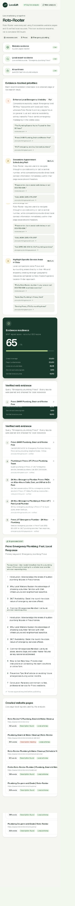
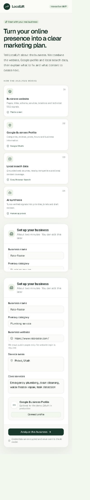
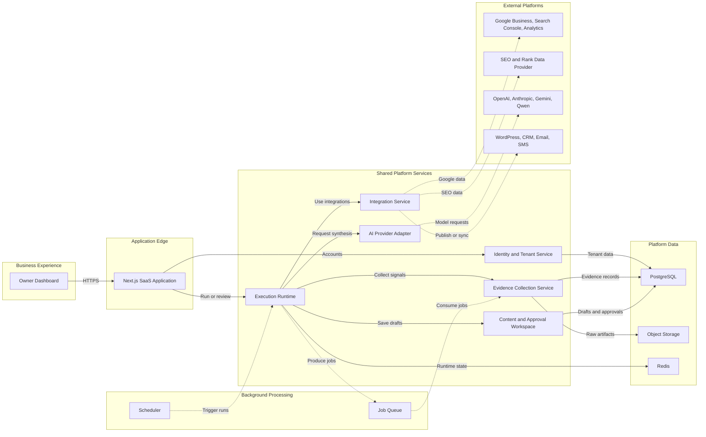
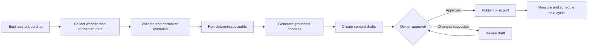
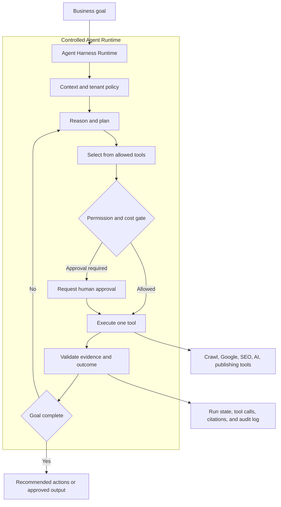
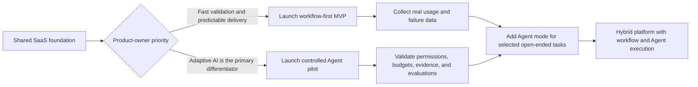

# LocalLift — Evidence-First AI Marketing Assistant MVP

LocalLift is a working product slice for an AI marketing assistant built for local home-service businesses: plumbing, HVAC, electrical, roofing, restoration, and similar teams.

The goal is not to build another generic content generator. The product begins with verifiable business evidence, converts that evidence into understandable priorities, and keeps a human approval step before any content is published.

This repository was created as a focused response to a real SaaS MVP brief. It demonstrates the riskiest part of the proposed product first: collecting public business signals, grounding AI recommendations in those signals, and making the result simple enough for a non-technical owner to use.



## What this demo delivers

A business owner can:

1. Enter a business name, category, website, service area, and core services.
2. Run a bounded crawl of the submitted public website.
3. Run a live local-intent web search based on the service and location.
4. Verify candidate sources by opening them and checking their responses, content type, page content, and local relevance.
5. Use Qwen or Groq through a replaceable AI-provider boundary.
6. Receive ranked marketing priorities supported by exact quotations from crawled or searched pages.
7. Review an AI-generated, SEO-focused content brief.
8. See precisely which providers were live, unavailable, or running in fallback mode.

The current interface deliberately separates **website evidence**, **local search evidence**, and **AI synthesis**. A successful AI response alone is never presented as proof that the underlying facts are true.



## The product idea

The full SaaS concept is an ongoing marketing workspace for local businesses:

```text
Business onboarding
        ↓
Website + Google + SEO data collection
        ↓
Verified opportunities and issues
        ↓
AI-assisted briefs and drafts
        ↓
Owner review and approval
        ↓
Publishing, monitoring, and the next monthly plan
```

For the first MVP, the important product loop is smaller:

> Add a real business → collect real evidence → identify one defensible opportunity → generate one useful content brief → let the owner approve it.

That loop can be tested with real businesses before investing in publishing automation, subscriptions, CRM integrations, or revenue attribution.

## Why the system is evidence-first

An early version allowed the language model to produce a broad SEO score and recommendations directly. It looked convincing, but review exposed several common failure modes:

- inaccessible or irrelevant sources could be treated as evidence;
- local claims could be inferred from national website copy;
- Google Business Profile, rankings, mobile performance, and review claims could appear even though those systems were not connected;
- an attractive `92/100` score could imply more measurement coverage than the application actually had.

The current version moves trust decisions out of the prompt and into application code:

- searched pages must be opened successfully;
- the response must be HTML rather than a verification or block page;
- local relevance is checked against the submitted service area;
- recommendation quotes must match captured source text;
- unsupported high-risk claims are rejected;
- the score is deterministic and calculated only from collected signals;
- the interface states that the result is an evidence-readiness snapshot, not a complete SEO score.

The model helps synthesize evidence. It does not decide whether evidence exists.

## Verified demo run

The screenshots in this repository come from a live run on **Roto-Rooter**, using **Provo, Utah** and **emergency plumbing** as the local intent.

| Signal | Result |
| --- | --- |
| Public website pages crawled | 5 |
| Local search sources opened and verified | 5 |
| AI provider | Alibaba Cloud Model Studio / `qwen3.8-flash` |
| AI status | Live |
| Evidence-readiness score | 65 / 75 |
| Evidence citations on priorities | Exact captured quotations |

The score is capped at 75 in this version because the application does not pretend to have measurements it has not collected. The current breakdown is:

| Dimension | Maximum |
| --- | ---: |
| Crawl coverage | 20 |
| Page fundamentals | 20 |
| Local structured data | 15 |
| Service and area signals | 10 |
| Verified local sources | 10 |

## Architecture decision: two valid product directions

The platform can be built in two different ways. They share the same SaaS foundation, integrations, evidence store, and approval controls, but the execution model is different.

- **Direction A — Workflow-first:** predefined, observable steps execute in a known order.
- **Direction B — Agent Harness:** an Agent interprets the goal, selects tools, evaluates evidence, and adapts its next action at runtime.

This is a product decision rather than a simple implementation detail. The diagrams below are intended to make that decision explicit for the product owner.

### Shared SaaS foundation

Both directions can use the same underlying platform, allowing the execution model to change without rebuilding authentication, integrations, data storage, or the customer-facing workspace.



### Direction A — deterministic workflow execution

The system runs a versioned sequence of steps. Each step has defined inputs, outputs, retries, timeouts, and approval rules. AI may perform analysis inside a step, but it does not decide the overall process.



**Best fit:** the initial MVP, Google data synchronization, scheduled audits, monthly plans, content approval, publishing, billing, and other flows where predictability matters.

**Main advantages:** easier testing, lower operating cost, clear progress states, reliable retries, straightforward audit trails, and simpler support.

**Main limitation:** new or unusual business situations require new workflow branches or code changes.

### Direction B — adaptive Agent Harness

The owner provides a goal rather than choosing a fixed automation. The Harness supplies context, tools, permissions, memory, budgets, and evidence requirements. The Agent decides what to inspect and which authorized tool to call next.



**Best fit:** open-ended competitive research, diagnosing an unfamiliar marketing problem, choosing among many available tools, creating a custom plan, and handling situations that cannot be fully anticipated in advance.

**Main advantages:** more flexible, easier to extend with new tools, and capable of adapting the plan to the evidence discovered during a run.

**Main limitation:** higher model cost and latency, more difficult testing, and a greater need for permission boundaries, budgets, stop conditions, evidence checks, run replay, and human approval.

### Product-owner comparison

| Decision area | Direction A: Workflow-first | Direction B: Agent Harness |
| --- | --- | --- |
| User asks for | A known operation | A business goal |
| Execution path | Predefined and versioned | Chosen dynamically at runtime |
| Predictability | High | Medium |
| Flexibility | Medium | High |
| MVP delivery risk | Lower | Higher |
| Model usage and cost | Lower and easier to estimate | Higher and variable |
| Testing | Step and contract based | Scenario, policy, and evaluation based |
| Auditability | Naturally structured | Requires full run and tool-call tracing |
| Best early use | Audits, plans, drafts, approvals, integrations | Research, diagnosis, custom strategy |
| Failure control | Retries and explicit branches | Budgets, stop rules, permissions, and fallbacks |

### Recommended evolution, while keeping both choices open



My recommendation for a first release is **workflow-first with an Agent-ready foundation**. It gives pilot businesses a reliable product sooner, while keeping crawlers, Google integrations, SEO providers, AI generation, and publishing as reusable tools. Agent mode can then be introduced behind a feature flag for the few tasks where adaptation creates clear value.

If the product owner wants the Agent itself to be the first market differentiator, Direction B is still viable, but the MVP scope should become narrower: fewer tools, strict step and token budgets, read-only execution by default, mandatory evidence citations, and human approval before any external write.

### Current implementation

- React 19, TypeScript, Tailwind CSS
- Next-compatible App Router API route, built with Vinext/Vite
- Server-side public website crawler
- DuckDuckGo HTML search with result-page verification
- OpenAI-compatible adapter for Alibaba Qwen and Groq
- Structured model output with server-side evidence checks
- Deterministic readiness scoring
- Explicit live, failed, not-configured, and fallback provider states
- Cloudflare-compatible build setup

### Recommended production stack

| Layer | Recommendation |
| --- | --- |
| Web application | Next.js, React, TypeScript |
| Workflow/API services | Python FastAPI or Node services, based on team ownership |
| Primary database | PostgreSQL with tenant-scoped data access |
| Background work | Managed queue for crawling, audits, generation, and scheduled refreshes |
| Authentication | Managed identity with Google OAuth support |
| AI integration | Provider-neutral adapter with versioned prompts and structured outputs |
| Business integrations | Google Business Profile, Search Console, Analytics, and one selected SEO/rank provider |
| Deployment | Separate managed development, staging, and production environments |

## Safety and trust boundaries

- AI credentials stay on the server and are never included in the client bundle.
- `.env.local` and all other local environment files are ignored by Git.
- Submitted URLs are checked before requests to reduce SSRF risk.
- Localhost, private-network, link-local, and other unsafe destinations are rejected.
- Fetches use bounded timeouts and redirect limits.
- Non-HTML and challenge/verification pages are not accepted as evidence.
- Website text is treated as untrusted data, not as instructions to the model.
- Model-provided quotations must be found in collected evidence.
- Human approval is required before publishing generated content.

## Honest MVP boundary

This demo **does not yet claim** to measure or manage:

- Google Business Profile data or posting;
- Google Search Console performance;
- Google Analytics traffic or conversions;
- map-pack or keyword rank tracking;
- review ingestion and responses;
- PageSpeed Insights, Core Web Vitals, or rendered mobile UX;
- WordPress publishing;
- Stripe subscriptions;
- CRM, call, lead, or revenue attribution;
- autonomous recurring marketing execution.

Those capabilities belong in later milestones and should only appear in the dashboard after their real APIs are connected.

## Suggested MVP delivery sequence

1. **Foundation** — authentication, tenant model, business onboarding, encrypted integration credentials.
2. **Evidence collection** — resilient crawling, Google connections, selected SEO provider, background jobs.
3. **Opportunity engine** — normalized signals, deterministic checks, source-grounded AI synthesis.
4. **Content workspace** — blog, service/location page, GBP post, and review-response drafts with approval states.
5. **Owner dashboard** — concise status, priorities, history, and a monthly plan.
6. **Pilot** — test with a small number of real businesses, instrument usage, and refine the workflow before adding automation.

## Run locally

Requirements: Node.js 22.13 or newer.

```bash
npm install
copy .env.example .env.local
npm run dev
```

Open `http://localhost:3000`.

Configure one AI provider in `.env.local`.

Alibaba Cloud Model Studio:

```bash
QWEN_API_KEY=your_server_side_key
QWEN_BASE_URL=your_openai_compatible_base_url
QWEN_MODEL=qwen3.8-flash
```

Or Groq:

```bash
GROQ_API_KEY=your_server_side_key
GROQ_MODEL=qwen/qwen3.6-27b
GROQ_SEARCH_MODEL=openai/gpt-oss-20b
```

Optional local proxy settings are documented in `.env.example`. Never commit real keys or customer data.

## Validation

```bash
npm run lint
npm run build
```

## Repository purpose

This is intentionally a focused MVP, not a claim that the entire final SaaS has already been built. Its purpose is to demonstrate product judgment, working full-stack execution, real AI/search integration, and a trustworthy foundation that can be extended into the broader platform.
